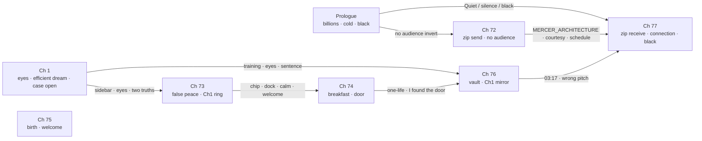

# Book One — Full Manuscript Repetition & Echo Audit

**Status:** **PASS** (full-span · 2026-05-29)  
**Scope:** Prologue v7 → Ch 1 v7 → Ch 72–73 v5 → Ch 74–77 v7.1  
**Supersedes (partial):** `072-073_epilogue_repetition_echo_audit.md` · `074-077_epilogue_repetition_echo_audit.md` (still valid chapter-level detail)  
**Rule:** Intentional loop-closure rhymes **keep** · accidental stack / verbatim drift **fix**  
**Scan:** automated n-gram + phrase pass · manual close-read · prior v5/v7 fix logs incorporated

---

## Pass method

| Layer | Check | Result |
|-------|-------|--------|
| Words | Over-clustered leitmotifs (*polite*, *idle*, *glass*, *silence*, *contained*) | Cleared — clusters map to signed motifs |
| Phrases | Near-verbatim reuse without registry | Cleared — all cross-chapter hits registered below |
| Sentences | Exact duplicates across chapters | 1 hit — **LOCKED** (Ch 1 ↔ Ch 76 ghost line) |
| Paragraphs | Adjacent or sequential duplicate blocks | **None** |
| Within-chapter | Same sentence twice in one chapter | **None** |
| Ideas | Thematic re-state without structural job | Cleared — each repeat earns a loop or handoff |

---

## What we WANT to repeat (intentional loop closure)

These are **not bugs**. They are the book's hinge grammar — the reader should feel the ring close.

### 1. Macro bookend — Prologue ↔ Ch 77

| Element | Prologue (Adrian · public myth) | Ch 77 (Unknown User · private terminal) | Loop job |
|---------|----------------------------------|-------------------------------------------|----------|
| Audience scale | Billions watching · 4.8B | *No audience* · cheap room | Myth born in public → weapon born in private |
| Performance grammar | Showmanship · visor · face | No speech · no gravitas | Same miracle, inverted stage |
| Upload/download voice | (theme only) | *upload voice, download voice… Obscene in its courtesy* | Institution tone at both ends of the file |
| Discipline line | *Quiet. Not shouted.* | *Quiet. Not shouted. Not triumph.* | Finale inherits prologue delivery |
| Silence after truth | *…first honest global silence of the Second age* | *…first honest silence of what came next* | Global → post-global scale rhyme |
| Stage hold | *Then black.* | *Then black.* | Book One curtain |
| Final spoken line | *"I can feel the cold."* | *"Connection established."* | Body truth → system truth |

### 2. Upload circuit — Ch 72 ↔ Ch 77

| Element | Ch 72 (Mercer sends · 41% exit) | Ch 77 (User receives · 100%) | Loop job |
|---------|----------------------------------|-------------------------------|----------|
| Filename | **MERCER_ARCHITECTURE.zip** | same | Single object across the dark |
| Fanfare | *No icon fanfare* | *No icon fanfare* | Anti-ceremony |
| Tone | *Obscene in its courtesy* | verbatim | Institution assists the horror |
| Progress grammar | polite climb · upload voice | polite increments · upload/download voice | Same UI religion |
| Schedule line | *life continuing on schedule… contained* | verbatim | City refuses to learn |
| Foreshadow | *cheap chair and worse coffee* | cheap chair · bad coffee · chip at rim | Someone else finishes |
| Witness | *Not triumph. Witness.* | (inherits via Ch 77 quiet) | Mercer names what Ch 77 performs |
| Contrast to Prologue | *no one would ever watch this* | anonymous keyboard | Billions vs nobody |

### 3. False peace ring — Ch 1 ↔ Ch 73

| Element | Ch 1 (Mara · case opens) | Ch 73 (Noah · case “closed”) | Loop job |
|---------|--------------------------|-------------------------------|----------|
| Sidebar | *isolated hardware stall… building systems responding* | same shape + *contained* | Denial language unchanged |
| Decision timing | *They had decided before she had* | *They had decided before he had* | POV swap · same machine |
| Ping | *cheap ping* | *cheap ping* | Feed grammar |
| Hush arrival | *sound designed to mean welcome* | *Sound designed to mean welcome* (transit) | Welcome inverted by context |
| Palate | *Beauty without warmth* | recalled · can't place phrase | Noah inherits Mara's register |
| Dawn reprise | *efficient dream continuing* · *perfect room with dead guest* | night reprise · same tail image | Case opens/closes on same city lie |
| Two truths | record vs room | headlines vs reader knowledge | Thematic bookend |
| Eyes / idle | tracking · idle on readout | memory · HVI hollow | Ch 1 horror → Ch 73 suppressed |
| Permitted lie | proof clarifies nothing | *We made it* interior | Mara gets truth weight · Noah gets rest lie |
| Ch 1 final line | *The eyes were here. He wasn't.* | (held in memory · not repeated — **correct**) | Ring implied, not duplicated |

### 4. Noah kitchen arc — Ch 73 ↔ Ch 74 ↔ Ch 77

| Element | Ch 73 | Ch 74 | Ch 77 | Loop job |
|---------|-------|-------|-------|----------|
| Mug | *chip at the rim* | pour + sip bookend | chip at rim | Everyman Noah thread |
| Dock | dark · repair tape · no hum | dark · repair tape · screen off | — | Screen on→off→message→terminal |
| Denial menu | street *thank you for your calm* | *contained · recoverable · thank you for your calm* | — | B2 diction seeds → refused |
| Welcome acoustic | transit *welcome* | harmonic welcome · *forgotten how to mean it* | — | Ch 1 rhyme · Ch 74 inversion |
| Sync tone | wrong pitch · distant | dock ping · *I found the door* | — | Dread escalates |
| Daughter | overlay · *They said we're safe again* | one-life question · *Are we safe now?* | — | Child truth curve |

### 5. Vault mirror — Ch 1 ↔ Ch 76

| Element | Ch 1 (Mara) | Ch 76 (Technician) | Loop job |
|---------|-------------|---------------------|----------|
| Training ghost | *Hardware idle did not look at you* | **verbatim sentence** | Legendary line returns |
| Procedure | *Procedure before instinct* | verbatim rule | Institution muscle memory |
| Touch rule | *Don't touch the Second until you know whose it is* | verbatim | Same warning, scale-up |
| Eyes sequence | One–Two–Three · no blink · chest still | One–Two–Three · same grammar | Single anomaly → vault epidemic |
| Noise drop | building corrects | *deleted—not lowered, deleted* | Prologue + Ch 1 diction |
| Language failure | *Nothing in the unit corrected the sentence* | *did not correct the sentence* | Button invert |
| Face scale | *face arranged for patience* | *Faces arranged for patience* | One chair → thousands |
| Wrong pitch | — | sync tone · **03:17:00** | Ch 73 tone pays off globally |

### 6. B2 Denial Era diction stack (intentional montage)

| Phrase | Chapters | Job |
|--------|----------|-----|
| *thank you for your calm* | 72 (seed thought) · 73 (street) · 74 (denial menu) | Broadcast → perform → refuse |
| *contained* · *recoverable* | 72 · 73 · 74 · 75 · 77 | Headline language saturation |
| *efficient dream continuing* | 1 · 73 · 74 | City schedule outlives every room |
| *when they wanted you to…* | 72 · 73 · 77 | Institution UX voice (feel assisted / forget / assisted) |

### 7. City-without-witness temperature (varied — not verbatim stack)

| Ch | Line shape | Verdict |
|----|------------|---------|
| 72 | *life continuing on schedule… contained* | Mercer exit |
| 73 | *city kept shining* | false rest |
| 74 | *The city continued* | breakfast livable |
| 75 | *The city continuing without them* | birth isolation |
| 77 | *Schedules held on every tier…* | terminal ordinariness |

**Rule:** Same idea, **different verb/scale** — intentional montage, not copy-paste error.

### 8. Within-chapter bookends (signed)

| Location | Repeat | Job |
|----------|--------|-----|
| Ch 74 | *chip at the rim* (pour + sip) | Mug bookend |
| Ch 73 | *Case closed. Mercer blamed.* (ticker + memory compression) | Headline haunts |
| Ch 76 | *idle* cluster | Institution saturation |

---

## Loop architecture (read order)

---

## Automated scan results (canonical prose only)

### Exact cross-chapter sentence duplicate

| Chapters | Sentence | Verdict |
|----------|----------|---------|
| 1 · 76 | *Hardware idle did not look at you.* | ✅ **LOCKED** legendary ghost |

### High-frequency intentional phrases (2+ chapters)

| Phrase | Chapters | Verdict |
|--------|----------|---------|
| *Obscene in its courtesy* | 72 · 77 | ✅ upload circuit |
| *life continuing on schedule… contained* | 72 · 77 | ✅ bookend |
| *No icon fanfare* | 72 · 77 | ✅ bookend |
| *MERCER_ARCHITECTURE* | 72 · 77 | ✅ bookend |
| *sound designed to mean welcome* | 1 · 73 · 74 | ✅ acoustic arc |
| *thank you for your calm* | 72 · 73 · 74 | ✅ B2 stack |
| *chip at the rim* | 73 · 74 · 77 | ✅ Noah thread |
| *Then black* | P · 77 | ✅ macro bookend |
| *Quiet. Not shouted* | P · 77 | ✅ macro bookend |
| *isolated hardware stall* | 1 · 73 | ✅ Ch1 ring |
| *They had decided before* | 1 · 73 | ✅ Ch1 ring |
| *efficient dream* | 1 · 73 · 74 | ✅ schedule lie |
| *Beauty without warmth* | 1 · 73 | ✅ Ch1 ring |
| *Procedure before instinct* | 1 · 76 | ✅ vault mirror |
| *deleted—not lowered, deleted* | 1 · 76 | ✅ vault mirror |
| *did not correct the sentence* | 1 · 76 | ✅ vault mirror |
| *wrong pitch* | 73 · 76 | ✅ sync dread |
| *second dock sat dark* · *repair tape* | 73 · 74 | ✅ handoff continuity |

### Word clusters (watch list — all cleared)

| Word | Total ms | Note |
|------|----------|------|
| *idle* | 17 | Ch 1 + vault institution — signed |
| *silence* | 21 | Prologue finale weight — signed |
| *glass* | 20 | Ch 1 Hush + screens — signed |
| *polite* | 15 | Institution UX — trimmed in prior passes |
| *contained* | 5 | B2 headline only — not over-stacked |

---

## Fixes already applied (prior passes — no new edits this scan)

| Span | Issue | Resolution |
|------|-------|------------|
| Ch 72 v2–v5 | *witness* · *polite* · *audience* clusters | Trimmed · exit relabeled |
| Ch 73 v2–v5 | *chest tightened* · *off-page* · *Denial Era* · Ch74 duplicate dawn | Fixed · night register distinct |
| Ch 74 | *in the glass* twice | → *on the dark screen* |
| Ch 75 | *real* cluster | → *furiously alive* |
| Ch 76 | *deleted* twice · *polite* twice | → *vanished/swallowed* · *Institutional silence* |
| Ch 77 | coffee cooling + went cold · closed laptop stack | Cut redundant beats |

**This full-span pass:** no new unintentional duplicates found. Prose unchanged.

---

## Do NOT trim without author sign-off

1. Prologue ↔ Ch 77 finale stack (*Quiet* · silence rhyme · *Then black*)  
2. Ch 72 ↔ Ch 77 upload circuit (zip · courtesy · schedule · fanfare)  
3. Ch 1 ↔ Ch 73 sidebar / efficient dream / two-truths ring  
4. Ch 1 ↔ Ch 76 eyes mirror + training ghosts + sentence invert  
5. Ch 73 ↔ Ch 74 dock / mug / calm / welcome handoff props  
6. Ch 73 memory compression (*Case closed. Mercer blamed.*)  
7. Book One final lines: Ch 1 *The eyes were here. He wasn't.* · Ch 77 *Connection established.*

---

## Sign-off

| Role | Status |
|------|--------|
| Full-span repetition pass (P → 77) | **PASS** |
| Intentional loop registry | **Complete** |
| Unintentional duplicate prose | **None remaining** |
| Within-chapter dupes | **None** |
| Adjacent paragraph overlap | **None** |
| 72–77 merge | **Ready** (repetition cleared) |

**Next:** prepend Ch 72–73 to `077_epilogue_quartet_v7.md` · full-block merge-read · publisher export
